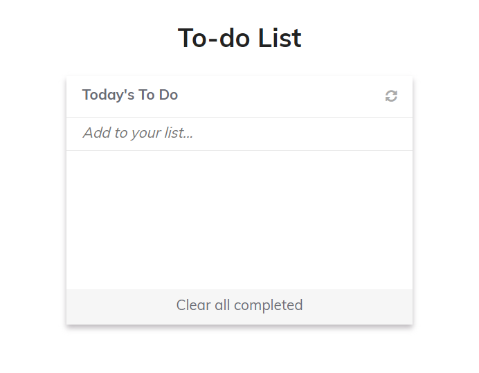

# To Do List
This is a To do list created using all the concepts teached at Microverse

## Built With

- HTML
- CSS
- JavaScript

## Getting started

### Prerequisites

- Browser (Google Chrome, Mozilla Firefox, Safari or any other browser)
- Text editor (strongly recommended VS Code)
- Empty directory where the repo is to be cloned

### To get a local copy of this repo

Run the following commands in the terminal in the next order:

- Step 1:  
  $ cd "here comes the path of your selected directory (double quotes must not be here)"

- Step 2:
  $ git clone https://github.com/tiagorahal/To-Do-List.git

### To run this project in your local environment

- Step 1:

  run npm install --save @fortawesome/fontawesome-free

  run npm install
  
  run npm run start

## Author

👤 **Tiago Rahal Aires**

- GitHub: [@tiagorahal](https://github.com/tiagorahal)
- Twitter: [@RahalAires](https://twitter.com/RahalAires)
- LinkedIn: [Tiago Rahal Aires](https://linkedin.com/tiagorahal)

## 🤝 Contributing

Contributions, issues, and feature requests are welcome!

Feel free to check the [issues page](https://github.com/tiagorahal/To-Do-List/issues).

## Show your support

Give a ⭐️ if you like this project!

## Acknowledgments

## 📝 License

This project is [MIT](./MIT.md) licensed.
